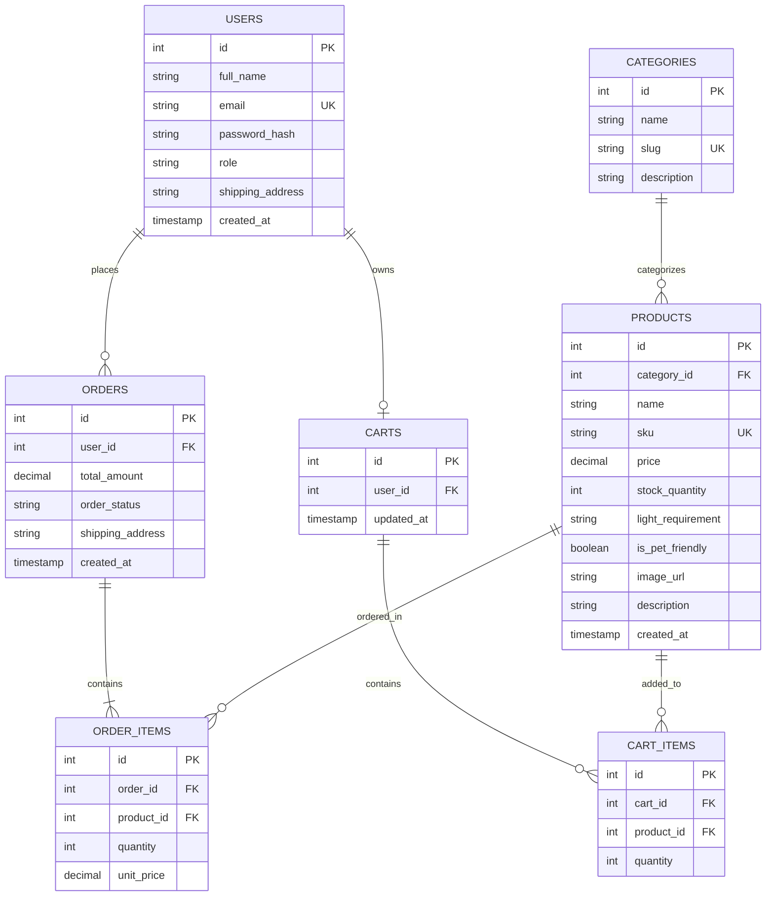

# Sprint 1: System Architecture & Scope Definition

**Project Name:** Root & Sprout – Curated Botanical Nursery & Care Hub  
**Document File:** `SPRINT_1.md`

---

## Section 1: Target Audience & Market Focus

* **Primary Persona:**
  * **Profile:** Sarah Lin, 28, urban apartment resident and remote professional.
  * **Demographics & Behavior:** Tech-literate consumer focused on interior wellness, modern living space aesthetics, and reliable online shopping.
  * **Constraints:** Low-to-moderate indirect sunlight in living quarters, cohabitation with domestic pets, and minimal prior botanical knowledge requiring clear maintenance instructions.
* **Core Pain Point:**
  * Standard e-commerce platforms fail to provide vital environmental parameters (e.g., pet safety ratings, sunlight compatibility, watering intervals) alongside plant listings, resulting in frequent plant mortality and mismatched potting accessories.
* **Domain Scope:**
  * A specialized retail platform delivering indoor foliage (low-light, pet-friendly, air-purifying), matching drainage planters, specialized soil substrates, and organic botanical care supplies.

---

## Section 2: Minimum Viable Product (MVP) Feature Scope

| Category | Feature Name | Description | Priority |
| :--- | :--- | :--- | :--- |
| Authentication | User Registration & Authentication | Password hashing and JWT-based authentication mechanism with role-based access control (Customer vs. Admin). | High (MVP) |
| Catalog | Product List & Search | Product browsing interface with taxonomy-based filtering (light requirements, pet friendliness, pot sizes) and text search. | High (MVP) |
| Cart | Cart Management | State persistent cart management (item addition, modification, and deletion) with dynamic subtotal calculations. | High (MVP) |
| Checkout | Order Processing | Mock or Stripe payment gateway integration, real-time transactional inventory decrement, and order object instantiation. | High (MVP) |
| Admin | Inventory Control | Administrative CRUD operations for product inventory, restock tracking, and category taxonomy management. | Medium |

---

## Section 3: Tech Stack Selection & Justification

* **Frontend Framework:** React (with Vite)
  * *Justification:* React offers a component-driven architecture and responsive client state management essential for multi-faceted catalog filtering and real-time cart updates without page reloads. Its extensive ecosystem, rapid virtual DOM updates, and strong community support accelerate frontend delivery while maintaining a seamless user experience across devices.
* **Backend Infrastructure:** Node.js with Express
  * *Justification:* Node.js provides a high-throughput, non-blocking asynchronous event loop that efficiently manages concurrent product browsing and checkout operations. Express offers lightweight, transparent routing, straightforward RESTful API endpoint configuration, and flexible middleware for JWT authorization and role verification.
* **Database Management System:** PostgreSQL
  * *Justification:* PostgreSQL delivers strict ACID compliance and row-level locking mechanisms critical for transactional integrity during simultaneous cart checkouts and inventory deductions. Relational foreign key constraints natively enforce data consistency between accounts, catalog entities, and order line items, providing reliability that non-relational alternatives lack.
* **Caching & Processing:**
  * *Justification:* Implemented as an in-memory key-value cache to store active shopping sessions and cache frequent catalog query results, reducing load on the primary relational database.

---

## Section 4: Entity-Relationship Diagram (ERD)

### Relational Cardinality & Integrity Rules

* `CATEGORIES` to `PRODUCTS` (`1:N`): One category classifies zero or many botanical products; each product references exactly one parent category foreign key.
* `USERS` to `CARTS` (`1:1`): Each registered account owns exactly one active persistent cart instance.
* `CARTS` to `CART_ITEMS` to `PRODUCTS` (`N:M` associative): Resolves many-to-many relationships by tracking specific items and line-item quantities added to a cart.
* `USERS` to `ORDERS` (`1:N`): A user may submit zero or multiple historical purchase orders over time.
* `ORDERS` to `ORDER_ITEMS` to `PRODUCTS` (`N:M` associative): Captures individual purchase lines while permanently preserving the `unit_price` at the exact time of transaction, maintaining immutable financial records regardless of future price adjustments in the catalog.
